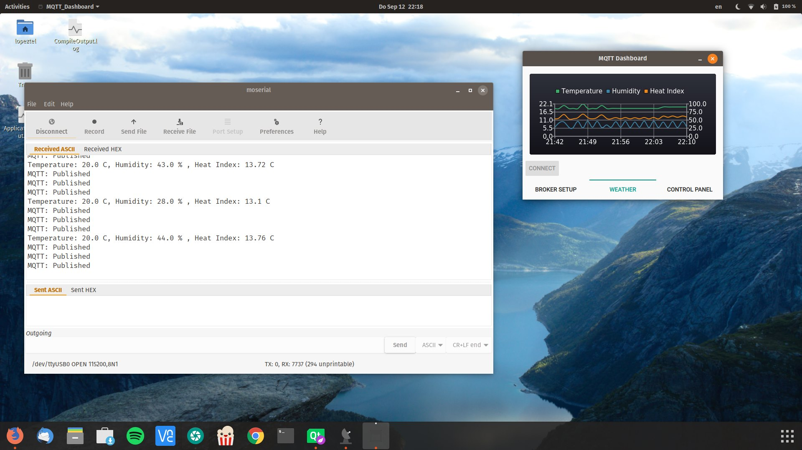
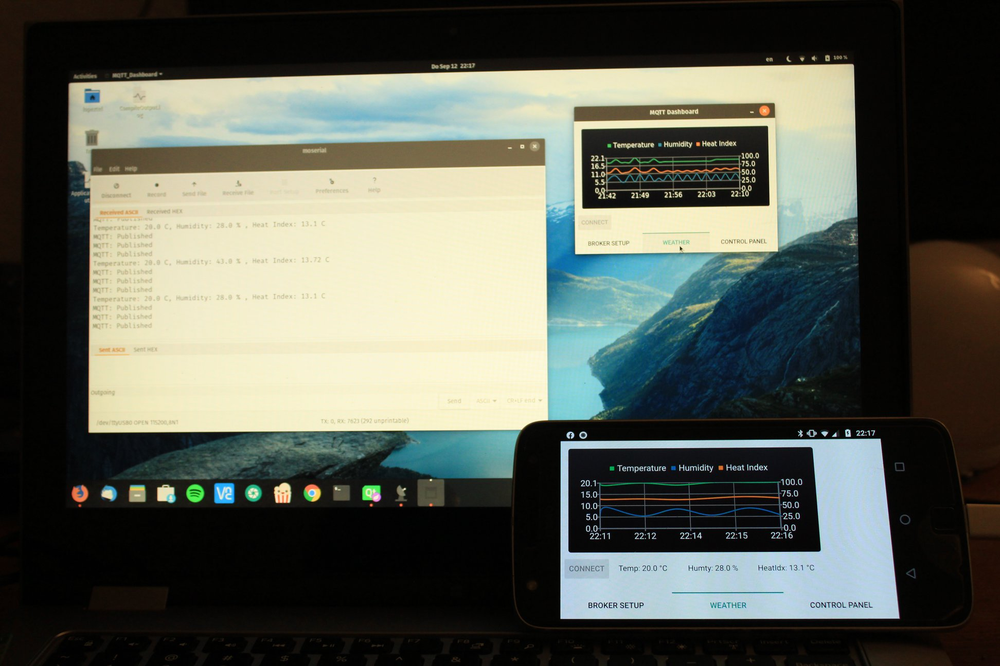

# MQTT Dashboard
## About
This project is something I worked on my spare time and I hope it is useful for any IoT projects out there.

The main idea is to have this as a centralized dashboard that receives and sends data from/to multiple IoT modules (ESP8266 or ESP32 based) by connecting to a MQTT broker.

## Requirements
+ [Qt](https://www.qt.io/) version 5.12.4, make sure to install:
  + Desktop gcc 64 bit (or equivalent)
  + ARM (whichever corresponds to the devices you'd be using: ARM64-v8a, ARMv7 or x86), if unsure ARMv7 will work for most devices
  + Qt Charts
  + Qt virtual keyboard (useful if deploying to Raspberry Pi, must be disabled for Android)
+ qtmqtt library from Qt, I am using branch 5.12.4 : [qtmqtt](https://github.com/qt/qtmqtt/tree/5.12.4)
+ MQTT broker, mine is local on a Raspberry Pi model 3Bv2

## Useful links
[Installing MQTT broker on Raspberry Pi](https://www.instructables.com/id/Installing-MQTT-BrokerMosquitto-on-Raspberry-Pi/)

## Changelog
+ Version 1.0
  + Support for temperature topics (humidity, temperature, heat index) from DHT11 sensor
  + Support for relay topic
  + Support for RGB control topics (both solid colors and fade)

## TODO
+ Implement fade transitions from Dashboard
+ Cross compile for Raspberry Pi model 3Bv2

## Contributing
Feel free to drop a line/contact me if interested in this project