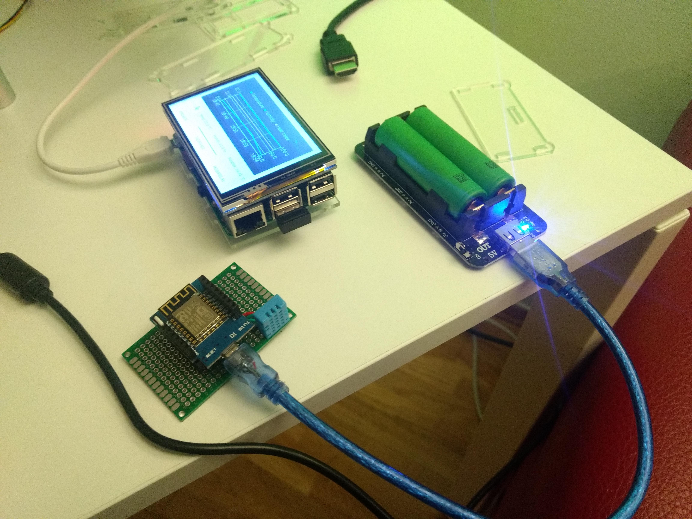

# MQTT Dashboard
## About
This project is something I worked on my spare time and I hope it is useful for any IoT projects out there.

The main idea is to have this as a centralized dashboard that receives and sends data from/to multiple IoT modules (ESP8266 or ESP32 based) by connecting to a MQTT broker.

##V 1.1

##V 1.2

## Requirements
+ [Qt](https://www.qt.io/) version 5.12.7, make sure to install:
  + Desktop gcc 64 bit (or equivalent)
  + ARM (whichever corresponds to the devices you'd be using: ARM64-v8a, ARMv7 or x86), if unsure ARMv7 will work for most devices
  + Qt Charts
  + Qt virtual keyboard (useful if deploying to Raspberry Pi, must be disabled for Android)
+ [qtmqtt](https://github.com/qt/qtmqtt/releases/tag/v5.12.7) library from Qt, I am using 5.12.7 release version
+ MQTT broker, mine is local on a Raspberry Pi model 3B+

## Useful links
[Installing MQTT broker on Raspberry Pi](https://www.instructables.com/id/Installing-MQTT-BrokerMosquitto-on-Raspberry-Pi/)

[MQTT+Raspberrypi+ESP8266](https://www.instructables.com/id/How-to-Use-MQTT-With-the-Raspberry-Pi-and-ESP8266/)

[MQTT+Raspberrypi+ESP8266](https://www.hackster.io/ruchir1674/raspberry-pi-talking-to-esp8266-using-mqtt-ed9037)
## Changelog
+ Version 1.0
  + Support for temperature topics (humidity, temperature, heat index) from DHT11 sensor
  + Support for relay topic
  + Support for RGB control topics (both solid colors and fade)
+ Version 1.1
  + Updated to Qt 5.12.7
  + Compiled for Raspberry Pi 3B+
+ Version 1.2
  + Override for Material Design thema
  + Tweaked for RGB Lamp usage

## TODO
+ Implement button that terminates application since it runs full screen on Raspberry Pi
+ Add reference to code on esp8266 Wemos D1 mini (another repo)

## Contributing
Feel free to drop a line/contact me if interested in this project
